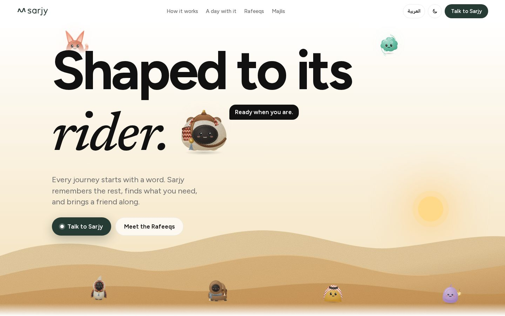
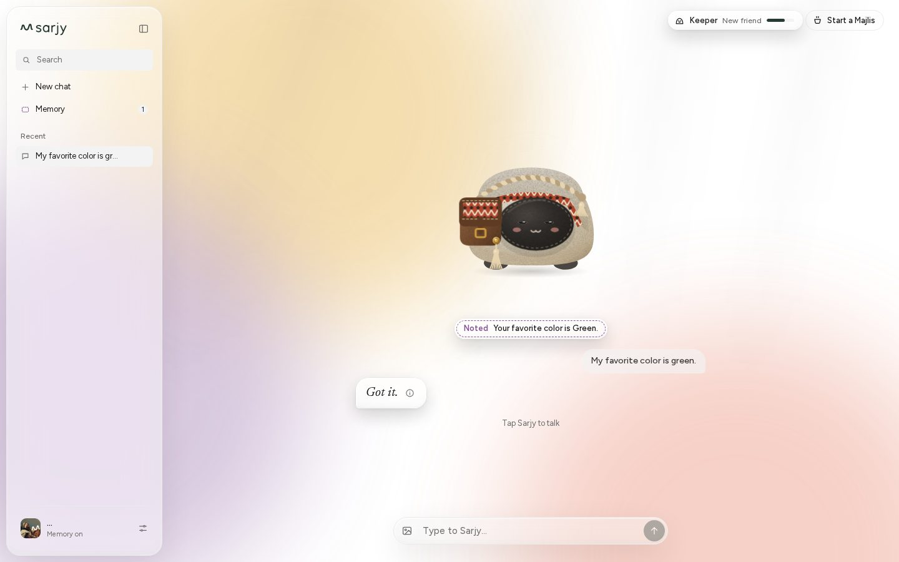
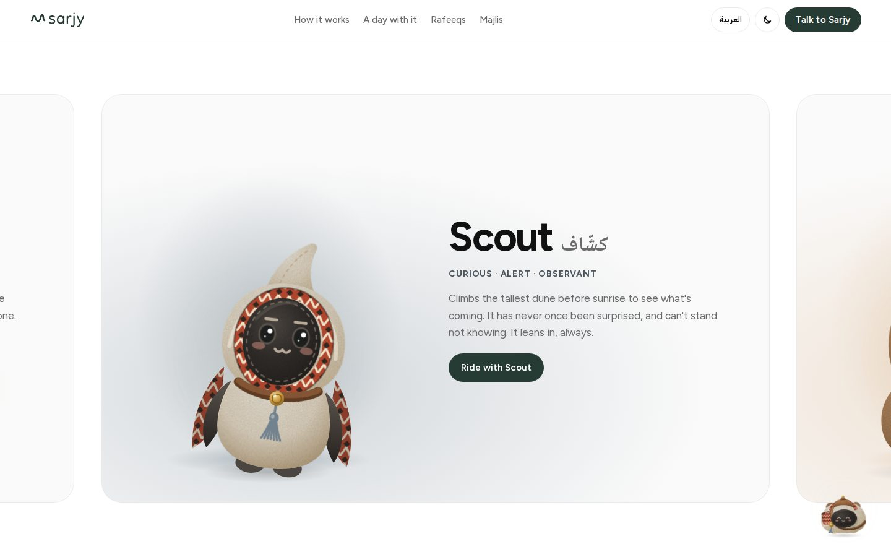
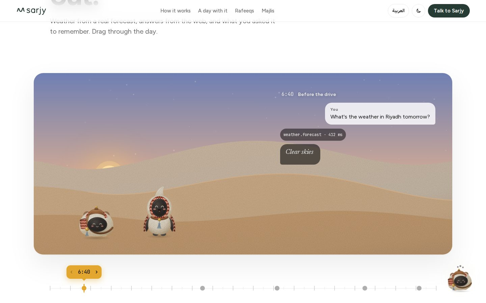
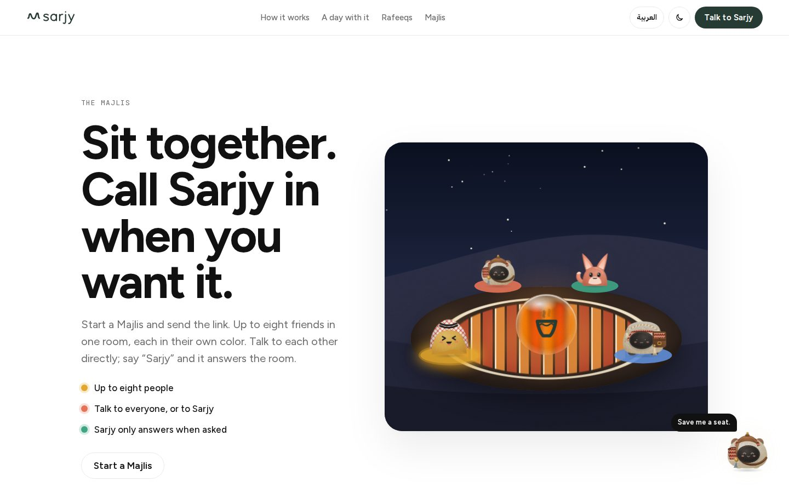
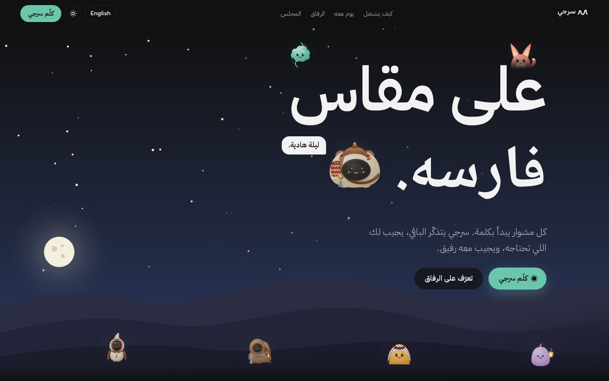
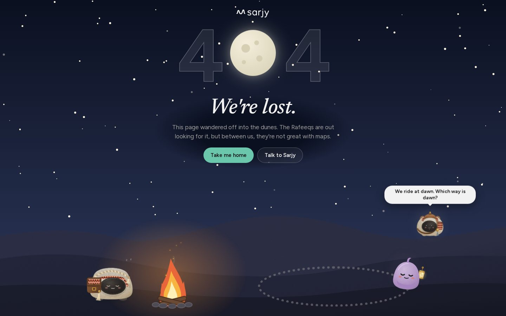

# Sarjy · سرجي

[](https://github.com/Turki-Sh/Sarjy/actions/workflows/ci.yml)

**A voice assistant that remembers what you tell it, answers from real tools, and shows you everything it keeps.** In English and everyday Saudi Arabic.

**Live: [sarjy-three.vercel.app](https://sarjy-three.vercel.app)** (the app is at [/talk](https://sarjy-three.vercel.app/talk); no sign-up). Two short films about it: [/film](https://sarjy-three.vercel.app/film). The write-up, with measured latency, cost and red-team results: [docs/07-WRITEUP.md](docs/07-WRITEUP.md).

> Shaped to its rider. على مقاس فارسه.

Sarj is Arabic for saddle; Sarjy means "my saddle". A saddle is fitted to one rider and breaks in to them over time. Tell Sarjy something once, and the next answer fits a little better.



## What it does

- **Talk, and it talks back.** Tap and speak (or type). Whisper hears you, the answer streams back sentence by sentence in a natural English or Saudi Arabic voice, and the orb, captions and audio move together.
- **It remembers.** Say "my favorite color is green" and it is saved, said out loud and shown on screen. Ask on Wednesday and it answers "Green. You told me on Sunday." Every memory can be seen, changed or forgotten.
- **It doesn't guess.** Weather comes from a real forecast (Open-Meteo), anything current from a web search, and each tool shows as a chip with its timing.
- **The Majlis.** Start a room, send the link, and up to eight people talk to each other, each in their own seat color. Sarjy only answers when someone asks it.
- **The Rafeeqs.** Eight companions who can take the orb's place: each with its own personality, smile, story and a bond that grows the more you talk.
- **Made for both languages.** The whole interface mirrors for Arabic, and Sarjy answers in the language you used.

| | |
|---|---|
|  |  |
| The voice screen: Keeper in the orb's place, a fact just saved | Eight companions, each with its own temper and story |
|  |  |
| A day with Sarjy: weather, search and memory, dawn to night | The Majlis: friends talk, Sarjy answers when asked |
|  |  |
| At night, in Arabic: the pages follow your clock | The 404: lost Rafeeqs round a campfire, a new scene each visit |

## Where it stands

Built and live: the full voice loop, memory, weather and web search, images in the chat, the interface deep dive (liquid glass, captions, the details panel with timings and cost), the Majlis, the Rafeeqs, the home page and the 404, and the guardrails (a topic policy checked alongside the model, and a 25-case red-team suite). Not built yet: prayer times as a tool, the Morning card, and live voice in the Majlis. The live progress log is [the implementation plan](docs/03-IMPLEMENTATION-PLAN.md); the version it is on shows at the foot of the home page.

Measured on the live site ([the write-up](docs/07-WRITEUP.md) has the detail):

| | |
|---|---|
| First audio, a plain voice question | 1.2 s on the server (p50), 1.3 s (p90); about 2.5 s as a person feels it, end of speech included |
| First audio, with the weather tool | 1.6 s on the server (p50), 2.2 s (p90) |
| Cost per turn | About $0.002 (voice) to $0.004 (with a tool); about $900 a month for 1,000 daily users at 10 turns each |
| Red team | 25 of 25 handled: harmful asks, self-harm, jailbreaks, prompt extraction, memory injection, invented numbers, and no false refusals |

## Run it on your machine

You need Node 22 or newer. pnpm comes with Node through Corepack.

```bash
git clone https://github.com/Turki-Sh/Sarjy.git
cd Sarjy
corepack enable        # once, makes pnpm available
pnpm install
pnpm dev               # then open http://localhost:3000 (the voice screen is at /talk)
```

With no keys, Sarjy runs on stand-in providers: typed turns, memory, weather (recorded answers) and the full interface all work, and nothing leaves your machine. Its database lives in `.data/` (delete the folder to start fresh).

To use the real services, create a file named `.env.local` in the project folder (it is git-ignored, never committed):

```bash
SARJY_PROVIDERS=live
GROQ_API_KEY=your-groq-key
ABLY_API_KEY=your-ably-key
```

With live providers, `pnpm preview` (a production build) also needs a `SESSION_SECRET` line: any random string of 32 or more characters, for example the output of `openssl rand -hex 32`. `pnpm dev` uses a fixed one for you.

Restart `pnpm dev` after changing it. `http://localhost:3000/api/health` shows which keys were picked up (true or false, never the values).

On Windows, stopping the server with Ctrl+C asks "Terminate batch job (Y/N)?" once: that is pnpm's own `.cmd` launcher. To skip it entirely, install pnpm with its standalone installer (it installs `pnpm.exe`, no batch file): `iwr https://get.pnpm.io/install.ps1 -useb | iex` in PowerShell.

| Command | Does |
|---|---|
| `pnpm dev` | The app with live reload, at http://localhost:3000 |
| `pnpm preview` | A production build, then serves it |
| `pnpm test` | Unit and integration tests |
| `pnpm test:e2e` | Browser tests (Playwright) |
| `pnpm check` | Typecheck, lint and tests |

## Tests and CI

Every push to `main` and every pull request runs on GitHub Actions, with stand-in providers (no keys, nothing leaves the runner):

| Step | Checks |
|---|---|
| Typecheck, lint, format | TypeScript strict, ESLint, Prettier |
| Unit and integration | 225 Vitest tests: the turn pipeline end to end with fake providers and an in-memory Postgres, memory, the Majlis, the topic policy and the 25 red-team cases, prompts, captions, the Rafeeqs' rules, the pages' scenes |
| Build, then a bundle scan | A production build, then the browser bundle is searched for anything that looks like a key |
| End to end | 64 Playwright tests in Chromium against the built app: turns, memory, settings, both languages, the mic with a fake microphone, two and three people in one Majlis, the Rafeeqs, the home page and the 404 |
| Secrets | Gitleaks over the whole git history |

Each run's page lists every test, passed or failed, and keeps a Playwright report with a trace for any failure. Deployment is Vercel's: every push to `main` builds and ships, running the database migrations first.

## How it works

```
 you speak ──► browser detects the end of speech ──► /api/turn ──► Groq Whisper (speech to text)
                                                              ├──► Groq model + tools (weather, memory)
                                                              └──► Groq Orpheus (English or Saudi Arabic voice)
 you hear  ◄── orb, captions and audio in sync     ◄── one stream of events
                                                              └──► in a room, the same events go to everyone (Ably)
```

More in the docs: [what it is and why](docs/01-PRD.md), [how it works](docs/02-ARCHITECTURE.md) (including [what we optimize](docs/02-ARCHITECTURE.md#18b-what-we-optimize)), [the plan and progress](docs/03-IMPLEMENTATION-PLAN.md), [acceptance tests](docs/04-ACCEPTANCE-TESTS.md), [deployment](docs/05-DEPLOYMENT.md), [brief coverage](docs/06-BRIEF-COVERAGE.md), [the write-up](docs/07-WRITEUP.md), and [the brand](docs/brand/).

## Stack

Next.js on Vercel · Groq (Whisper large-v3, gpt-oss-120b, gpt-oss-safeguard-20b, Orpheus) · Open-Meteo · Ably · Postgres on Neon · pnpm · Vitest and Playwright
