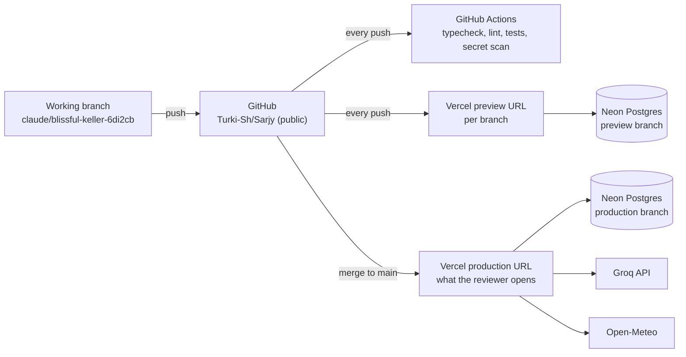

# 05 · Deployment

How Sarjy gets from a git push to a URL a reviewer can open, and how the keys stay secret in a public repository.

---

## 1. Topology

| Piece | Service | Plan |
|---|---|---|
| Code | GitHub, public repository | Free |
| Hosting and functions | Vercel, Git integration | Hobby (free) |
| Database | Neon Postgres, added through the Vercel Marketplace | Free |
| Speech, model, voice | Groq | Free to start, upgrade if limits bite |
| Weather | Open-Meteo | Free, no key |
| CI | GitHub Actions | Free for public repositories |

## 2. Environments

| | Local | Preview | Production |
|---|---|---|---|
| Where | Your machine or the Claude cloud session | A Vercel URL per branch and per push | The main Vercel URL |
| Triggered by | `npm run dev` | Any push | Merge into `main` |
| Providers | `fake` by default; `live` if a key is present | `live` | `live` |
| Database | PGlite (in-process, no setup) or a Neon dev branch | Neon branch for that git branch | Neon main branch |
| Secrets from | `.env.local` (git-ignored) | Vercel environment variables (Preview) | Vercel environment variables (Production) |

The Neon integration creates a database branch for each preview deployment, so migrations and test data on a preview never touch production memories.

## 3. Secrets in a public repository

The rules, in order of importance:

1. **Secrets exist only in two places:** Vercel project settings (marked Sensitive, so they cannot be read back) and your git-ignored `.env.local`. Never in code, commits, issues, screenshots or chat.
2. **Never prefix a secret with `NEXT_PUBLIC_`.** That prefix copies the value into the JavaScript every visitor downloads.
3. **Only `src/server/env.ts` reads secrets,** and it imports `server-only`, which makes the build fail if any browser code imports it. It validates every variable with zod at startup, so a missing key fails loudly on deploy instead of quietly at the first request.
4. **The browser never calls Groq.** All provider calls go through our API routes, which also enforce rate limits.
5. **CI checks it:** gitleaks scans every push and the full history; after the build, a script searches the client bundle for key patterns (Groq keys start with `gsk_`) and fails the build if it finds one.
6. **If a key ever leaks,** rotate it in the Groq console first, then update Vercel and redeploy. Deleting the commit is not enough: public commits are scraped within minutes.

| Variable | Secret | Set where | Purpose |
|---|---|---|---|
| `GROQ_API_KEY` | Yes | Vercel (Production, Preview), `.env.local` | Whisper, the model, Orpheus |
| `DATABASE_URL` | Yes | Set automatically by the Neon integration | Postgres |
| `SESSION_SECRET` | Yes | Vercel, `.env.local` | Signs the identity cookie. `openssl rand -base64 32` |
| `SARJY_PROVIDERS` | No | CI and local only | `fake` or `live` (production defaults to `live`) |

## 4. First-time setup

You do these once, in your own accounts. About 20 minutes.

**Groq**
1. Sign in at console.groq.com and create an API key named `sarjy-prod`.
2. Keep it in your password manager until step 7 below. Do not paste it anywhere else.

**Vercel**
3. Sign in at vercel.com with GitHub. Add New, Project, import `Turki-Sh/Sarjy`.
4. Framework: Next.js (detected). Leave build settings as they are; the repository's `vercel.json` and `package.json` set them.
5. Settings, Functions: set the region to Frankfurt (`fra1`). See section 5.

**Neon**
6. In the Vercel project: Storage, Create Database, Neon (Marketplace). Region: AWS Frankfurt (`eu-central-1`). Connect it to the project for Production and Preview, with preview branching on. This sets `DATABASE_URL`.

**Environment variables**
7. Settings, Environment Variables. Add `GROQ_API_KEY` and `SESSION_SECRET` for Production and Preview, and mark both Sensitive.
8. Redeploy. Open `/api/health` on the deployment: it should report the providers and database as configured (true or false only, never values).

**Git**
9. When the first milestone is merged, set `main` as the repository's default branch on GitHub and as the production branch in Vercel (Settings, Git). Reviewers read the default branch.

**Optional: live testing from the Claude cloud session.** The cloud session that builds Sarjy cannot reach Groq or Open-Meteo by default. To let it run live checks, open the cloud environment's settings (the environment menu in the session's title bar, then Edit): add `GROQ_API_KEY` as an environment variable, and allow `api.groq.com`, `api.open-meteo.com` and `geocoding-api.open-meteo.com` in network access. Without this, all development there uses the fake providers and you run the live checks on preview URLs.

## 5. Region

Put the functions and the database in the same region, as close as possible to the people who will use it. Sarj's reviewers are most likely in the Gulf or Egypt, and Frankfurt is much closer to them than the default US East. Groq serves from several regions and routes requests itself. On Day 2 we will measure time to first audio from a Frankfurt and a US East deployment and keep the faster one; the numbers go in the README.

## 6. Database migrations

- The schema lives in `src/server/db/schema.ts`. `npm run db:generate` writes a SQL migration into `src/server/db/migrations/`, which is committed and reviewed like code.
- Migrations run as part of the Vercel build (`npm run db:migrate && next build`), against the Neon branch for that deployment. A failed migration fails the deploy, so production is never left half-migrated.
- Tests run the same migrations against PGlite, so the SQL that ships is the SQL that was tested.

## 7. CI and CD

**On every push (GitHub Actions)**

1. `npm ci`
2. Typecheck, lint, format check
3. Unit and integration tests (Vitest, fake providers, PGlite)
4. Build, then scan the client bundle for secrets
5. E2E tests (Playwright, Chromium, fake mic, fake providers)
6. Gitleaks on the full history

**Deploys (Vercel Git integration)**

- Every push gets a preview URL, posted on the pull request.
- Merging into `main` deploys production.
- We merge the working branch into `main` through a pull request at the end of each milestone, once CI is green.

## 8. Quota plan

The free Groq tier is enough for development if we are careful, and we upgrade the moment it is not.

| Limit (free tier, per day) | Our usage per spoken answer | What we do |
|---|---|---|
| Voice: about 100 requests | At most 2 (first sentence, then the rest) | Pre-render fixed lines (greeting, errors, limits) into `public/voice/`; backup browser voice after the limit |
| Model: about 1,000 requests and 200,000 tokens for the main model | 1 or 2 requests, about 2,000 tokens each | Compact prompt; fallback model with its own limits |
| Whisper | 1 request | Well within limits |

**Upgrade triggers:** we hit any daily limit during testing, or the day we submit, whichever comes first. The paid tier costs cents per demo session; a few dollars covers the whole review. If the console offers a spend cap, set one.

## 9. Watching it run

- **Logs:** each turn writes one structured log line to Vercel's runtime logs: a hashed user id, language, which tool ran, which model answered, and the timings for every stage. No transcripts or memory values in logs.
- **Health:** `/api/health` for a quick check before a demo.
- **Timings:** the details panel in the app shows the same numbers per turn.

## 10. Rollback

Vercel keeps every deployment. If a production deploy breaks, use Instant Rollback in the Vercel dashboard to put the previous deployment back in seconds, then fix forward on the branch. Database migrations are additive only during the build, so an older deployment still works against a newer schema.

## 11. Before submitting

- [ ] Production URL opens in a fresh incognito window, no login, and the demo script runs end to end
- [ ] The same, on a phone
- [ ] `/api/health` all true
- [ ] CI green on `main`; `main` is the default branch
- [ ] Gitleaks clean; bundle scan clean; no `.env` files in the repository
- [ ] Groq key upgraded (or limits confirmed sufficient) and spend cap set
- [ ] README has the live URL, the API justification, the deep dive write-up and the latency numbers
- [ ] Repository URL and deployment URL entered in the Ashby questionnaire
